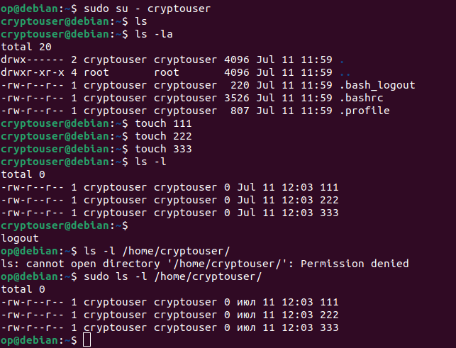
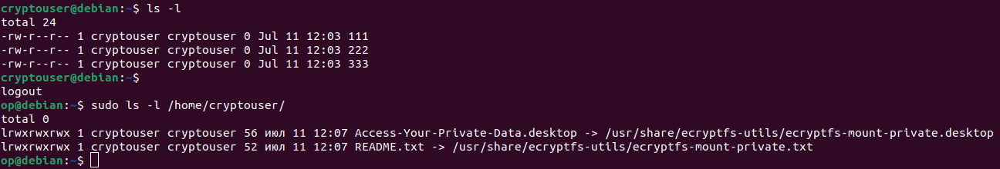
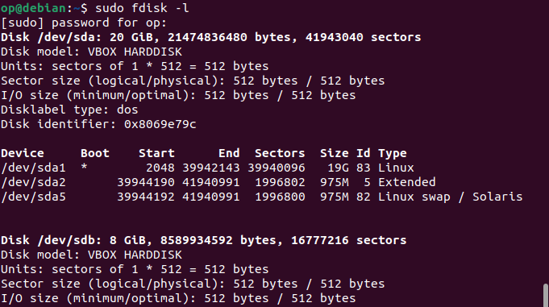
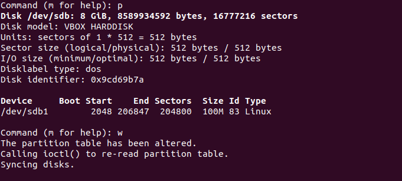
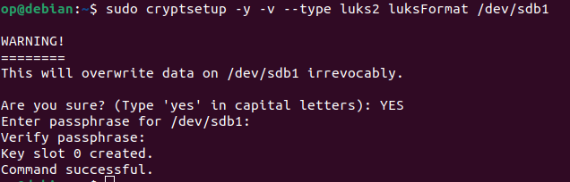
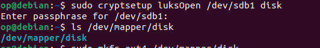
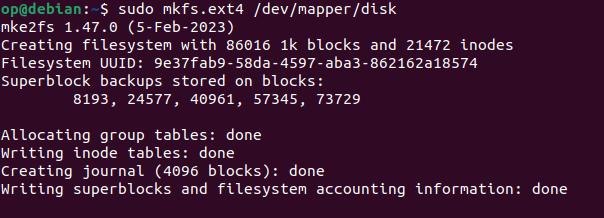
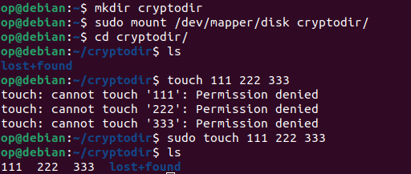
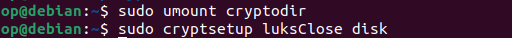

# Домашнее задание к занятию "`Защита хоста`" - `Байков Михаил`

---

### Задание 1

1. Установите **eCryptfs**.
2. Добавьте пользователя cryptouser.
3. Зашифруйте домашний каталог пользователя с помощью eCryptfs.

*В качестве ответа  пришлите снимки экрана домашнего каталога пользователя с исходными и зашифрованными данными.*  

### Решение 1
1. Добавляем пользователя cryptouser, создаем от его имени 3 тестовых файла. Проверяем что они видны от пользователя с правами суперюзера.

2. Устанавливаем ecryptfs-utils, проводим миграцию домашней директории пользователя cryptouser через `ecryptfs-migrate-home -u cryptouser`. Проверяем доступность тестовых файлов под пользователем cryptouser. И недоступность под суперпользователем.

---

### Задание 2

1. Установите поддержку **LUKS**.
2. Создайте небольшой раздел, например, 100 Мб.
3. Зашифруйте созданный раздел с помощью LUKS.

*В качестве ответа пришлите снимки экрана с поэтапным выполнением задания.*

### Решение 2
1. Добавили в систему еще один диск размером 8Гб

2. Создаем на добавленном диске раздел размером в 100Мб

3. Шифруем созданный раздел

4. Открываем созданный раздел LUKS, в маппере создается устройство `disk`

5. Создаем на зашифрованном разделе файловую систему ext4

6. Создаем папку `cryptodir` и монтируем туда наш зашифрованный раздел. Для теста создаем 3 файла на зашифрованном разделе.

7. Размонтируем зашифрованный раздел из папки `cryptodir` и закрываем зашифрованный раздел.

